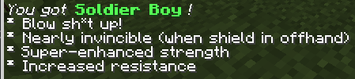

# TheBoysPowerPack

 

A datapack adding several powers from The Boys.

## Installation

You can install the datapack like you'd do any other. Zipped release archives can be found on the [releases page](https://github.com/jibstack64/TheBoysPowerPack/releases).

**OP must be enabled on the world.**

## Usage

Use the `/trigger tb_power_up` command to give you a random ability.

Once an ability is allocated to a player, the only way to change it is by manually resetting the scoreboard value:
```
/scoreboard players set PlayerName tbpp_power 0
```

You can manually set someone's ability manually by setting their `tbpp_power` value to the ID of the power.

```
/scoreboard players set PlayerName tbpp_power 4
# ^ 4 = A-Train
```

You can activate your ability by **jumping while crouching**.

### 1. *Homelander*

When activated, you get flung directly up 100 or so blocks. You slowly fall back to the ground, giving you time to drift away from enemies.


### 2. *Translucent*

While invisible, the player is (nearly) invulnerable, to mimic Translucent's diamond skin.

!

### 3. *Hughie*

The most utilitious power: teleportation.

Basic teleportation requires you to activate your ability while looking at the block you wish to teleport to. The maximum range is 60 blocks.

Memory teleportation can be used by holding a stick in your offhand. When you activate your ability with a stick in your offhand, it sets the teleportation destination. Toggle with a stick in your offhand again and you will be teleported back to the pre-set destination location. Dying will reset it, too.


### 4. *A-Train*

High speed and a massive damage buff is provided while the ability is activated.


### 5. *Soldier Boy*

On toggling the ability, a massive explosion will occur 5 blocks in front of the player. The player is invulnerable but all other mobs, players and entities within the area will be affected.

If you have this ability and hold a shield in your offhand, you will be granted with the same invulnerability-level as Translucent in their invisible state (very tough).



### 6. *Billy Butcher*

While activated, laser beams will shoot out of your eyes, destroying any and all blocks that your eyes cross. You slowly lose health to poison while laser-ing as to mirror Butcher's illness in the show.

Very high resilience and strength come with this ability.


